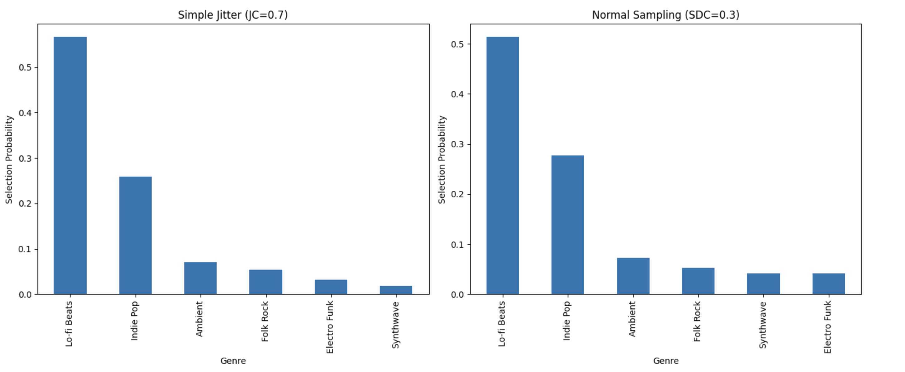

## The Tyranny of the Top Rank 

Ever feel like your favorite music app is playing *DJ Déjà Vu*, stuck on an endless loop of your top-played genres or artists you already know and love? Or, if you're an artist, have you wondered how your fresh, amazing track can cut through the noise and find new ears? This isn't just a feeling; it's a common challenge in any system that ranks and recommends items – whether it's songs, movies, products, or even internal company resources.

Most recommendation algorithms are designed to be highly effective at finding what they think is the absolute "best" for you based on your past behavior and similar users. This deterministic precision is great for relevance, but it can lead to a predictable experience. We call this the *tyranny of the top rank*. Users might get trapped in *filter bubbles*, missing out on diverse and potentially delightful new discoveries. Recommendations can become stale, and for content creators, it means items ranked just slightly lower than the top might never see the light of day.

But what if there was a simple way to shake things up, to inject a bit of serendipity without completely abandoning relevance? What if a tiny, controlled 'nudge' – a bit of strategic randomness – could unlock a richer, more diverse experience?

That's exactly what we're going to explore. We'll look at how introducing a small amount of "jitter" or using "probabilistic sampling" on an item's relevance score can significantly improve the diversity of recommendations, making them more engaging and useful in the long run.

## The Core Idea: Controlled Randomness

At the heart of our approach is the idea of controlled randomness. Instead of always picking the item with the highest calculated relevance score, we slightly perturb these scores randomly before making the final selection. This manages the classic *exploration-exploitation trade-off*:

*   **Exploitation**: Picking the known best (high deterministic score).
*   **Exploration**: Trying out other potentially good options to discover new value and provide variety.

Our goal is to lean heavily on exploitation (we still want relevant recommendations!) but introduce just enough exploration to make things interesting.

## Our Journey: From Internal Challenge to Broader Solution

Our journey into this started with a similar challenge: how to ensure a wide range of valuable internal training resources were being utilized, rather than just the same few top-scorers. We found that even with well-defined scoring for relevance and effectiveness, a deterministic approach led to a predictable and limited selection. 
This prompted us to explore how controlled randomness could improve the diversity of assigned trainings. 
This experience highlighted a universal issue in ranked selections, leading us to generalize these techniques for broader application.

## Our Case Study: Crafting a "Discovery Weekly" Playlist

Imagine we're building a feature like Spotify's "Discover Weekly." We have a pool of newly released or under-the-radar songs. For a given user, our main recommendation engine has already calculated a `UserMatchScore` (0-100) for each song, indicating how well it fits their known taste profile.

If we always pick the songs with the top 10 `UserMatchScores`, the playlist might be highly relevant but could lack variety, potentially just offering more of what the user already listens to. We want to introduce songs that are still a good match but might be from slightly different sub-genres or a bit less obvious.

This is where our randomization techniques come in. We'll apply them to the `UserMatchScore`.

## Two Simple Techniques for Introducing Diversity

We explored two main methods:

1.  **Simple Jitter (Uniform Distribution Jitter):**
    *   *Concept:* We take each song's `UserMatchScore` and add a small, random "nudge" to it. This nudge can be positive-only (only boosting scores) or positive-negative (allowing scores to be randomly increased or decreased).
    *   *How it works:*
        *   We define a **Jitter\_Coefficient (JC)**.
        *   For the current set of candidate songs, we find the range of their `UserMatchScores` (Max Score - Min Score).
        *   The maximum possible nudge is `JC * score_range`.
        *   For each song, a random factor (e.g., between -1 and 1 for positive-negative jitter) is multiplied by this maximum nudge to get the actual jitter amount.
        *   `Jittered_Score = UserMatchScore + Actual_Jitter_Amount`.
        *   The song with the highest `Jittered_Score` is selected.
    *   *Effect:* This gives a chance for songs with slightly lower `UserMatchScores` to be selected if they get a "lucky" positive nudge while a higher-scoring song gets an "unlucky" negative nudge (or a smaller positive one).

2.  **Probabilistic Normal Sampling:**
    *   *Concept:* We treat each song's `UserMatchScore` not as a fixed point, but as the average (mean) of a bell curve (Normal distribution) representing its potential "appeal" in any given instance.
    *   *How it works:*
        *   We define a **Standard\_Deviation\_Coefficient (SDC)**.
        *   The standard deviation (`std_dev`) for each song's Normal distribution is `SDC * score_range` (score range of current candidates).
        *   For each song, we draw one random sample from its specific Normal distribution: `Sampled_Score = random_sample_from_Normal(mean=UserMatchScore, std_dev=std_dev)`.
        *   The song with the highest `Sampled_Score` is selected.
    *   *Effect:* Songs with higher `UserMatchScores` are statistically more likely to produce the highest sample, but there's a "smoother" probability of songs with slightly lower scores winning. The chance of an upset depends on how much the bell curves of different songs overlap.

## Simulating the Impact

To see these techniques in action, we ran simulations. For a chosen set of candidate songs for our "Discovery Weekly," we repeatedly selected songs using different **JC** and **SDC** values and tracked:

*   How often the original #1 song (by `UserMatchScore`) was still selected.
*   How often the selection stayed within the Top-K original ranks (e.g., Top-10).
*   How many different songs were selected over time (a measure of diversity/exploration).
*   What proportion of the available candidate songs were "touched" by the selection process.

*(Here, you would embed your generic plots, similar to the ones we discussed, showing lines for "Avg Prob(Select Top 1)" decreasing and "Avg Distinct Items Selected" increasing as JC/SDC increases. Label axes generically, e.g., "Randomization Coefficient (JC/SDC)" and "Selection Probability" or "Number of Distinct Items".)*



**Example Plot Caption:** *Fig 1: As the randomization coefficient (JC or SDC) increases, the probability of selecting the deterministically top-ranked item typically decreases (blue line), while the number of unique items selected over many trials tends to increase (green line), indicating greater exploration.*

## Key Findings from Simulation

Our simulations (even with simplified scores) consistently showed:

*   **Increased Diversity:** Both methods successfully increased the variety of items selected compared to a purely deterministic approach.
*   **Controllability:** The **JC** and **SDC** parameters provided effective control over the trade-off. Small values resulted in minor deviations from the top ranks, while larger values promoted more significant exploration.
*   **Simple Jitter (positive\_negative type):** Tended to explore more broadly for a given relative coefficient, sometimes selecting items further down the deterministic rank if their "luck factor" was high.
*   **Normal Sampling:** Provided a "smoother" exploration, where items with scores closer to the top had a proportionally better chance of being selected during an "upset" than items ranked much lower. The probability of selection decreased more gradually.
*   The "best" coefficient depends on the specific goals: if aggressive discovery is desired, a higher coefficient might be chosen. If maintaining very high relevance is paramount, a lower coefficient is better.

## Benefits & Considerations

**Pros** of these simple randomization techniques:

*   **Simplicity:** Easy to understand and implement on top of existing ranking scores.
*   **Effective Diversity Boost:** Can significantly improve the variety of recommendations.
*   **Improved User Experience:** Can reduce recommendation fatigue and increase serendipitous discoveries.
*   **Low Computational Cost:** Adds minimal overhead to the selection process.

**Cons/Considerations:**

*   **Not Adaptive:** These methods don't "learn" from user feedback (e.g., if a jitter-selected song is consistently skipped). They rely on the quality of the underlying `DeterministicScore`.
*   **Offline Tuning:** The **JC** or **SDC** parameter needs to be tuned, often through offline simulations like ours, to find the right balance for your specific application.
*   **Potential for "Sub-optimal" (by one metric):** By design, you will sometimes recommend items that aren't the absolute #1 by your primary deterministic score. This is the trade-off for diversity.

## Conclusion: Embrace the (Controlled) Chaos!

Always showing the "best" isn't always best for long-term user engagement or content discovery. Introducing a small, controlled amount of randomness, like the Simple Jitter or Probabilistic Normal Sampling techniques we explored, can be a surprisingly powerful and easy-to-implement strategy. It helps break out of predictability, surfaces a wider range of relevant items, and can make your recommendation system feel more dynamic and intelligent.

So, next time you're building a ranking system, consider adding a little "jitter bug" – your users (and maybe even your content providers) might thank you for the delightful new discoveries!

# Tutorial: Adding Diversity to Rankings with Jitter & Normal Sampling

Below is a self-contained Python tutorial demonstrating how to add controlled randomness to ranking scores using Simple Jitter and Probabilistic Normal Sampling.

Colab tutorial can be found [here](https://colab.research.google.com/drive/1MvHbsMfijdokbNPU4URTxxME-PaY2pFP?usp=sharing)
---

## 1. Setup and Sample Song Data

```python

import pandas as pd
import numpy as np
import random
import matplotlib.pyplot as plt

# --- Generate Synthetic Song Data ---
num_songs = 100  # Candidate songs for our discovery playlist
genres = ["Indie Pop", "Electro Funk", "Ambient", "Folk Rock", "Lo-fi Beats", "Synthwave"]
subgenres = {
    "Indie Pop": ["Dream Pop", "Bedroom Pop"],
    "Electro Funk": ["Nu-Disco"],
    "Ambient": ["Drone", "Chillout"],
    "Folk Rock": ["Indie Folk"],
    "Lo-fi Beats": ["Chillhop"],
    "Synthwave": ["Retrowave"]
}

song_data = []
for i in range(num_songs):
    genre = np.random.choice(genres)
    base_score = 60
    if genre in ["Indie Pop", "Lo-fi Beats"]:
        base_score += np.random.randint(20, 35)
    else:
        base_score += np.random.randint(0, 20)
    user_match_score = np.clip(base_score + np.random.normal(0, 8), 40, 100)
    song_data.append({
        'SongID': f"Song_{i+1:03}",
        'Title': f"{genre} Track {i+1}",
        'Artist': f"Artist_{np.random.randint(1, 20)}",
        'Genre': genre,
        'UserMatchScore': round(user_match_score, 2)
    })

songs_df = pd.DataFrame(song_data)

print("Sample Candidate Songs:")
print(songs_df.head())

print("\nTop 5 Songs (Deterministic by UserMatchScore):")
print(songs_df.sort_values('UserMatchScore', ascending=False).head())

```

## 2. Implementing the Selection Functions
### A. Simple Jitter Function

```python

def apply_simple_jitter_selection(df_candidates, score_column,
                                  jc_value, jitter_type='positive_negative',
                                  id_column='SongID'):
    if df_candidates.empty:
        return None
    if len(df_candidates) == 1:
        return df_candidates[id_column].iloc[0]

    temp_df = df_candidates.copy()
    max_score = temp_df[score_column].max()
    min_score = temp_df[score_column].min()
    score_range = max_score - min_score

    if score_range > 0 and jc_value > 0:
        n_rows = len(temp_df)
        if jitter_type == 'positive_negative':
            random_factors = np.random.uniform(-1.0, 1.0, size=n_rows)
        elif jitter_type == 'positive_only':
            random_factors = np.random.rand(n_rows)
        else:
            random_factors = np.zeros(n_rows)

        jitter_amount = random_factors * jc_value * score_range
        temp_df['Jittered_Score'] = temp_df[score_column] + jitter_amount
    else:
        temp_df['Jittered_Score'] = temp_df[score_column]

    max_jittered_score = temp_df['Jittered_Score'].max()
    top_songs = temp_df[
        np.isclose(temp_df['Jittered_Score'], max_jittered_score)
    ][id_column].tolist()

    return random.choice(top_songs) if top_songs else None

```

### B. Probabilistic Normal Sampling Function
```python
def apply_normal_sampling_selection(df_candidates, score_column,
                                    sdc_value, id_column='SongID'):
    if df_candidates.empty:
        return None
    if len(df_candidates) == 1:
        return df_candidates[id_column].iloc[0]

    temp_df = df_candidates.copy()
    max_score = temp_df[score_column].max()
    min_score = temp_df[score_column].min()
    score_range = max_score - min_score

    std_dev = max(0, sdc_value * score_range) if score_range > 0 else 0

    if std_dev > 0:
        temp_df['Sampled_Score'] = np.random.normal(
            loc=temp_df[score_column],
            scale=std_dev
        )
    else:
        temp_df['Sampled_Score'] = temp_df[score_column]

    max_sampled_score = temp_df['Sampled_Score'].max()
    top_songs = temp_df[
        np.isclose(temp_df['Sampled_Score'], max_sampled_score)
    ][id_column].tolist()

    return random.choice(top_songs) if top_songs else None

```

## 3. Running a Small Simulation

```python

N_PLAYLISTS_TO_SIMULATE = 100
PLAYLIST_SIZE = 10

TUTORIAL_JC = 0.7
TUTORIAL_JITTER_TYPE = 'positive_negative'
TUTORIAL_SDC = 0.3

all_jitter_selections = []
all_normal_selections = []
candidate_songs_df = songs_df.copy()

for _ in range(N_PLAYLISTS_TO_SIMULATE):
    for _ in range(PLAYLIST_SIZE):
        selected_jitter = apply_simple_jitter_selection(
            candidate_songs_df, 'UserMatchScore', TUTORIAL_JC, TUTORIAL_JITTER_TYPE
        )
        if selected_jitter:
            all_jitter_selections.append(selected_jitter)

    for _ in range(PLAYLIST_SIZE):
        selected_normal = apply_normal_sampling_selection(
            candidate_songs_df, 'UserMatchScore', TUTORIAL_SDC
        )
        if selected_normal:
            all_normal_selections.append(selected_normal)

jitter_counts = pd.Series(all_jitter_selections).value_counts(normalize=True)
normal_counts = pd.Series(all_normal_selections).value_counts(normalize=True)

print("\n--- Simple Jitter Selections (Top 10) ---")
print(pd.merge(
    jitter_counts.head(10).rename("Prop_Jitter"),
    songs_df, left_index=True, right_on='SongID'
)[['SongID','Title','Genre','UserMatchScore','Prop_Jitter']])

print("\n--- Normal Sampling Selections (Top 10) ---")
print(pd.merge(
    normal_counts.head(10).rename("Prop_Normal"),
    songs_df, left_index=True, right_on='SongID'
)[['SongID','Title','Genre','UserMatchScore','Prop_Normal']])

```

## 4. Visualizing the Diversity

```python
# Prepare genre distributions
df_jitter = pd.merge(jitter_counts.rename("Prob"), songs_df[['SongID','Genre']],
                     left_index=True, right_on='SongID')
jitter_genre_dist = df_jitter.groupby('Genre')['Prob'].sum().sort_values(ascending=False)

df_normal = pd.merge(normal_counts.rename("Prob"), songs_df[['SongID','Genre']],
                     left_index=True, right_on='SongID')
normal_genre_dist = df_normal.groupby('Genre')['Prob'].sum().sort_values(ascending=False)

# Plotting
fig, axes = plt.subplots(1, 2, figsize=(14, 6))
jitter_genre_dist.plot(kind='bar', ax=axes[0])
axes[0].set_title(f'Simple Jitter (JC={TUTORIAL_JC})')
axes[0].set_ylabel('Selection Probability')

normal_genre_dist.plot(kind='bar', ax=axes[1])
axes[1].set_title(f'Normal Sampling (SDC={TUTORIAL_SDC})')
axes[1].set_ylabel('Selection Probability')

plt.tight_layout()
plt.show()

# Deterministic baseline
deterministic = songs_df.sort_values('UserMatchScore', ascending=False).head(
    N_PLAYLISTS_TO_SIMULATE * PLAYLIST_SIZE
)
deterministic_dist = deterministic['Genre'].value_counts(normalize=True)

plt.figure(figsize=(7, 6))
deterministic_dist.plot(kind='bar')
plt.title('Deterministic Top Scores')
plt.ylabel('Proportion')
plt.show()

```

